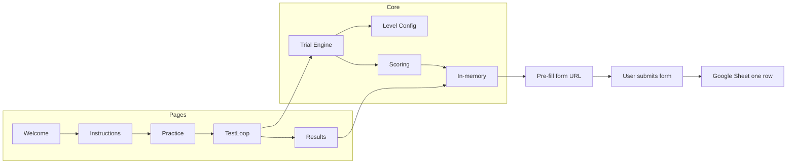

# Tic Tac Toe Memory Test – Implementation Plan

This document is the full implementation plan: base design plus UX and scoring revisions. Build a web app that measures visual spatial working memory via tic-tac-toe-style grids; results are submitted to a Google Form (one row per participant).

---

## Tech stack

- **Web app**: React + Vite + TypeScript.
- **Styling**: CSS (or CSS modules), light neutral background, dark gray grid lines, black X/O, square responsive cells.
- **Data**: Google Form linked to a Google Sheet. One row per submission. When the user finishes the test, the app opens a **pre-fill URL** with demographics and summary; the user submits the form once. Full trial data stays in the app and in JSON/CSV download only.

---

## Architecture

- **Pages**: Welcome → Instructions → (optional) Practice → Test loop → Results.
- **Router**: Single-page app, routes for `/`, `/instructions`, `/practice`, `/test`, `/results`.
- **State**: Participant (demographics, anonymous id, session seed) in React state; trial state (level, phase, response map, timers) inside the test loop.
- **Trial engine**: Level config + session seed → generate trial(s) → display phase (ready → grid(s) → fixation) → reconstruction phase → score → persist; advance or discontinue or finish.

---

## 1. Welcome and demographics (Page 1)

- **UI**: Title “Tic Tac Toe Memory Test”, subtitle per design; form: Name (required), Age (10–90, required), Gender (dropdown: Male, Female, Nonbinary, Prefer not to say, Self describe), Location (optional).
- **Validation**: Block “Start Test” until Name, Age, Gender are valid.
- **On submit**: Create participant (anonymous id, demographics, timestamp, session random seed); navigate to Instructions.

---

## 2. Instructions (Page 2)

- **UI**: Title “Instructions”; bullet list describing **only the task** (no scoring, no levels, no feedback rules):
  - You will see a grid with X and O (and sometimes other shapes to ignore).
  - Remember the exact positions of X and O.
  - The grid will disappear; then you rebuild it from memory.
  - Place shapes from the **palette** into the grid (drag or tap shape then tap cell).
  - Only X and O count; ignore other shapes.
  - Some trials show two grids one after another; rebuild both in order.
  - Work as quickly and accurately as you can; guess if unsure.
- **Actions**: “Begin” button; optional “Practice trials” toggle (default On).
- **On Begin**: If practice On → Practice page; else → Test loop.

---

## 3. Practice (Page 3, conditional)

- **When**: Only if “Practice trials” is On.
- **Content**: Exactly **2 practice trials** so the participant learns the task.
  - Trial 1: 3×3, 1 symbol, X in center only; display 5000 ms (or 3000 ms for practice); no delay; no distractors.
  - Trial 2: 3×3, 2 symbols, random positions; display 2500 ms; no distractors.
- **Rule**: Participant **must pass** each practice trial (100% correct) to advance. Same reconstruction UI as main test (palette + grid). After both passed: “Practice complete. The test will now begin.” → “Start Test” → Test loop.

---

## 4. Test loop (Page 4)

### 4.1 Level configuration

- **Source of truth**: Config array (e.g. `levelConfig.ts`) with: `gridSize`, `numTargets`, `numGrids`, `displayTimeMs`, `delayMs`, `interGridBlankMs`, `hasDistractors`, `numDistractors`, `responseDecoysEnabled`.
- **MVP**: Levels 1–10.
- **Gradual difficulty**:
  - **Easiest (Level 1):** Stimulus shown for **5 seconds** (`displayTimeMs = 5000`). No distractors, no decoys.
  - Then shorten display time and add delay; only at **higher levels** add display distractors, then response decoys in the palette. Decoys are part of level difficulty, not a separate toggle.
- **Special case**: Level 1 Trial 1 = X in center only (cell index 4 for 3×3).

### 4.2 Trial generation

- **Seed**: Session seed (stored with participant) for reproducible trials.
- **Per grid**: Build cell indices; for L1T1 force center X; else pick `numTargets` distinct cells; assign balanced X/O; if level has distractors, pick `numDistractors` cells and assign Triangle/Star/Diamond/Square at random (never on target cells).
- **Output**: Target map (cell → X|O) and display map (targets + distractors for rendering).

### 4.3 Display phase

- “Get ready” 500 ms → show grid(s) for `displayTimeMs`; between two grids show blank `interGridBlankMs`; then fixation cross for `delayMs`.
- Symbols: X and O black, thick; distractors gray outline (Triangle, Square, Star, Diamond). No level or trial number shown.

### 4.4 Reconstruction phase

- **Title**: “Rebuild the grid”. If 2 grids: “Grid 1 of 2” / “Grid 2 of 2” only (no level number).
- **Interaction**: **Shape palette** (X and O; at higher levels also decoy shapes). Participant **drags** (or tap shape then tap cell) shapes **into grid cells**. Cells are drop targets. Allow “clear cell” or drag back to palette. Placing a decoy counts as commission error. Do not show “correct/incorrect” or score.
- **Submit**: Button “Submit”. Participant clicks Submit to check. **Next** is **only enabled when the response is 100% correct** for that grid (all targets correct, zero commission errors). If not correct, they can edit and submit again (no limit on attempts).
- **Time limit**: **2 minutes (120 s)** per reconstruction. On timeout, auto-submit. If that response is not correct, they can keep editing and resubmitting until they pass (no extra time limit for that grid). Record reaction time (start of reconstruction to first submit or timeout).
- **Advance**: After passing, show “Next” (or “Continue”); they click to go to next grid, next trial, or Results. No auto-advance.

### 4.5 Scoring

- **Per grid**: CorrectPlacements (right symbol in right cell), CommissionErrors (something in a cell that should be empty), OmissionErrors (target wrong or missing). GridAccuracyPercent = (CorrectPlacements / numTargets) × 100.
- **Pass**: 100% correct and 0 commission for that grid.
- **Primary score for participant**: **Total points** = total CorrectPlacements across all trials (1 point per correct symbol).
- **Imperfect**: Trial is imperfect if not 100% correct (any wrong/missing target or commission error).
- **Discontinue rule**: After each trial, if the **last 3 trials** are all imperfect, **end the test** and go to Results. Compute summary from all trials completed so far.
- **Two-grid trials**: Score per grid; combine for trial pass/imperfect and discontinue.

### 4.6 Flow control

- Two trials per level. After 2 trials, next level; after last level (10 for MVP), Results.
- If last 3 trials are imperfect → Results (discontinue).
- Store each trial: participantId, level, trialIndex, gridIndex, gridSize, numTargets, numGrids, displayTimeMs, delayMs, distractorCount, targetMap, responseMap, correctPlacements, commissionErrors, omissionErrors, accuracyPercent, reactionTimeMs, trialCorrectBinary (perfect or not).

---

## 5. Results page (Page 5)

- **Display**: Name, Age, Gender, Date/time; **Total points** (total correct placements); **HighestLevelPassed**; **OverallAccuracyPercent**; **MeanReactionTimeMs**; optionally LevelPassedCount, TotalCorrectPlacements, TotalTargets. This is the **first time** the participant sees any performance info.
- **Comparison**: “Normative comparison not available yet. This tool requires a larger validation sample.” (Option 1 later: percentile from sheet if ≥30 in same age band/gender.)
- **Actions**: “Download results as JSON”, “Download results as CSV”; **“Submit results to study”** opens Google Form pre-fill URL in a new tab (demographics + summary); user submits form → one row in linked sheet.

---

## 6. Google Form (one row per submission)

- **During test**: Data in React state (optional localStorage backup).
- **On “Submit results to study”**: Build pre-fill URL with form base + entry IDs; open in new tab; user submits once → one row in sheet.
- **Sheet columns**: Name, Age, Gender, Location, Date, Highest Level Passed, Overall Accuracy %, Mean Reaction Time (ms), Level Passed Count, Total Correct Placements, Total Targets.

### Form base URL and entry IDs (for implementation)

- **Base**: `https://docs.google.com/forms/d/e/1FAIpQLSfkNqgUCk1NacIs9R36BSUIk2RZjafbgjo40khIru1g-S0Q2A/viewform`
- **Entry IDs**: Name 789348548, Age 1922394649, Gender 1816413769, Date 447483951, Highest Level Passed 1329618290, Overall Accuracy % 1015731778, Mean Reaction Time 598043661, Level Passed Count 1944454944, Total Correct Placements 351321749, Total Targets 298165890.
- **Gender options** (exact): Male, Female, Non-Binary, Prefer-Not to say.
- **Date**: Format as MM/DD/YYYY for form if required.

Store form ID and entry IDs in env (e.g. `VITE_GOOGLE_FORM_BASE`, `VITE_ENTRY_NAME`, …) or a small config; build URL with `encodeURIComponent` for text fields.

---

## 7. Summary of key rules

| Area | Rule |
|------|------|
| **Reconstruction UI** | Shape palette (X, O; decoys at higher levels) + drag or tap-to-place into grid; clear cell allowed. No tap-cell selector. |
| **Test chrome** | No level/trial numbers, no accuracy or score during test. Only “Get ready”, grid(s), “Rebuild the grid”, “Grid 1/2 of 2” when applicable. |
| **Flow** | Must pass (100% correct) to see Next; can resubmit until pass. Discontinue after 3 imperfect trials in a row. |
| **Timing** | 2 minutes per reconstruction; auto-submit on timeout; can keep trying until pass. |
| **Level design** | Level 1: 5 s display. Decoys only at higher levels; gradual ramp. Practice: 2 trials, must pass both. |
| **Scoring** | 1 point per correct symbol. Total points = TotalCorrectPlacements. Store full trial data for analysis and form. |
| **Instructions** | Task only; mention palette and “only X and O count”; do not explain scoring or feedback. |

---

## 8. File structure (suggested)

- `src/App.tsx` – router and layout.
- `src/pages/` – Welcome, Instructions, Practice, Test, Results.
- `src/components/` – Grid (display + reconstruction), ShapePalette, Symbol (X, O, distractors), FixationCross, drop targets for cells.
- `src/lib/` or `src/engine/` – levelConfig, trialGenerator (seed-based), scoring, formUrl (build pre-fill URL).
- `src/types/` – Participant, Trial, LevelParams, TargetMap, ResponseMap.
- `.env.example` – document `VITE_GOOGLE_FORM_BASE`, `VITE_ENTRY_NAME`, `VITE_ENTRY_AGE`, etc.

---

## 9. Implementation order

1. Project setup (Vite + React + TypeScript, router).
2. Types and level config (Level 1 = 5 s display; gradual difficulty; decoys only at higher levels).
3. In-memory state for participant + trials; `buildFormPrefillUrl` and form entry ID config.
4. Welcome + Instructions (task-only text, practice toggle).
5. Grid and symbols: display grid; reconstruction with ShapePalette + drop targets (drag or tap-to-place).
6. Trial engine: display phase, reconstruction phase, 2-min limit, pass-to-advance, scoring, discontinue rule.
7. Practice (2 trials, must pass both).
8. Test loop (levels, 2 trials per level, discontinue after 3 imperfect).
9. Results (summary, total points, form button, JSON/CSV download).

---

## 10. Accessibility

- Large symbols and touch-friendly targets.
- High contrast (black on light; gray distractors).
- Do not rely on color alone (shapes and labels distinguish X/O and decoys).
