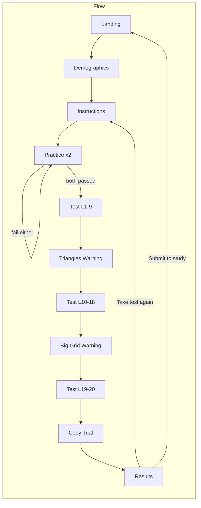

# Tic-Tac-Toe Memory Test – Consolidated Tweaks Plan

This document combines the original redesign with all clarifications. Use it as the single source of truth for implementation.

---

## 1. Overview

| Area | Current | New |
|------|--------|-----|
| Display time | Varies by level | **2 seconds** for all levels |
| Levels | 30 levels, 2 trials each, double grid | **20 levels, 1 trial per level** (20 trials total), single grid only |
| Levels 1–9 | 1–9 targets, various | 1–9 targets, **random placement** every time |
| Levels 10–18 | Mixed | 9 targets, 3x3, **triangle distractors only** |
| Levels 19–20 | N/A | 4x4 grid, **9 shapes only**, triangle distractors |
| Distractors | TRI, STAR, DIAMOND, SQUARE | **Triangles only** |
| Interstitials | None | Before level 10: triangle warning + example; before level 19: bigger grid + empty 4x4 example |
| Copy trial | None | One copy trial (full 3x3, copy into empty grid, record correct + time) |
| Memory scoring | Total correct placements | **1 pt per correct level 1–18, 2 pts per correct level 19–20** (max 22) |
| Theme | Neutral gray/white | **Purple and gray** |
| Practice | Pass to continue | **Must pass both trials**; else redo practice |
| Instructions | Text only | **Half-filled grid example** |
| Take test again | N/A | Clear test data only, keep demographics, go to Instructions |
| Full reset | N/A | **Only when clicking "Submit results to study"** (Google Form) → clear all, go to Landing |

---

## 2. Level config and trial generation

**File: `src/lib/levelConfig.ts`**

- Define **20 levels**, all `numGrids: 1`, all `displayTimeMs: 2000`.
- **Levels 1–9:** `gridSize: 3`, `numTargets: 1` through `9`, no distractors, no decoys.
- **Levels 10–18:** `gridSize: 3`, `numTargets: 9`, `hasDistractors: true`, `numDistractors: 2` (or 3), `responseDecoysEnabled: true`.
- **Levels 19–20:** `gridSize: 4`, `numTargets: 9`, same distractor/decoy settings.
- Single reconstruction time limit for all (e.g. 60s or 2 min). No `interGridBlankMs` (no double grid).
- Export `NUM_LEVELS = 20`.

**File: `src/lib/trialGenerator.ts`**

- Always build **one grid** per trial (remove double-grid loop).
- **Random placement every time:** remove special case for “Level 1 Trial 1 X in center.”
- Distractors: use **only `'TRI'`** (no STAR, DIAMOND, SQUARE).
- Keep `balancedSymbols` and random cell selection.

---

## 3. Test flow: one trial per level, interstitials, routing

**Trials:** One trial per level (trialIndex 0 only). After completing level N’s single trial, advance to level N+1 (or to a warning page / copy / results).

**New routes/pages:**

- **Triangles warning** (e.g. `/test/triangles-warning` or inline phase): Shown **before level 10**. Text: triangles will appear; ignore them. Show one **triangle example** (e.g. `DistractorShape` with `type: 'TRI'`). Button: **Next** → resume Test at level 10.
- **Big grid warning** (e.g. `/test/big-grid-warning` or inline phase): Shown **before level 19**. Text: grid will be bigger. Show **empty 4x4 grid**. Button: **Next** → resume Test at level 19.

**File: `src/pages/Test.tsx`**

- **Single grid only:** Remove `gridIndex`, `isTwoGrids`, “Grid 1 of 2”, interGridBlank phase.
- **One trial per level:** After submitting the single trial for a level, advance: level 9 → triangles warning; level 18 → big grid warning; level 20 → `/copy`.
- After level 20 complete → navigate to `/copy` (not `/results`).
- Remove or keep discontinue rule as desired (e.g. remove for simplicity).

**File: `src/App.tsx`**

- Add routes for TrianglesWarning, BigGridWarning, Copy. Test receives `startLevel` (or equivalent) via `useLocation().state` after each warning.

---

## 4. Practice: must pass both trials

**File: `src/pages/Practice.tsx`**

- Two practice trials (e.g. 1 symbol, then 2 symbols; display 2s to match main test).
- **Rule:** Participant must **pass both** (e.g. `trialCorrectBinary` for each) to proceed.
- If **either** trial is failed: show message “You need to pass both practice trials to continue. Try again.” and a button that **resets practice** (trialIndex back to 0, clear state) and runs both trials again. Do not navigate to Test until both are passed.
- On both passed: “Practice complete. The test will now begin.” → **Start Test** → `/test`.

---

## 5. Instructions: half-filled grid example

**File: `src/pages/Instructions.tsx`**

- Remove the bullet about “two grids one after another.”
- Add a **half-filled 3x3 grid** as a visual example (e.g. 4–5 cells with X and O). Use existing grid component (e.g. `DisplayGrid` with a fixed `displayMap`). Label e.g. “Here’s an example of a grid you might see.”
- Optional: one line about the copy task (“Later you will do a quick copy task: copy a grid into an empty grid as fast as you can.”).

---

## 6. Copy trial

**New page: `src/pages/Copy.tsx`** (route `/copy`)

- **Layout:** Top: full **3x3 grid** with 9 symbols (X/O), randomly generated. Bottom: **empty 3x3 grid** + **ShapePalette** (X, O, Clear; no decoys).
- **Task:** Copy the top grid into the bottom as fast as possible. Top grid stays visible. Timer starts on page load (or first interaction—specify in implementation).
- **Completion:** “Submit” / “Done” records: (1) **correct copy** (binary, via `scoreGrid` → `trialCorrectBinary`), (2) **time taken** (ms).
- Store in app state (e.g. `copyResult: { correct: boolean; timeMs: number } | null`). Then navigate to `/results`.

**File: `src/context/AppState.tsx`**

- Add `copyResult` and `setCopyResult`. Clear on “Take the test again” and on full reset.

---

## 7. Scoring and results

**File: `src/lib/summary.ts`**

- **Memory points (weighted, per level):** For each trial in `trials`, if `trialCorrectBinary`: add **1 point** for level 1–18, **2 points** for level 19–20. Sum = **memoryPoints** (max 22).
- Add **memoryPoints** to `SummaryMetrics` in `src/types/index.ts`.

**File: `src/pages/Results.tsx`**

- Show **Memory:** memory points (e.g. “X / 22”).
- Show **Copy:** “Correct: Yes/No”, “Time: X.X s”.
- **“Take the test again”** button: `setTrials([])`, `setCopyResult(null)`, **keep** `participant`, `navigate('/instructions')`.
- **“Submit results to study”** (Google Form) button: call `openFormInNewTab(...)`, **then** full reset: `setParticipant(null)`, `setTrials([])`, `setCopyResult(null)`, `navigate('/')` (Landing). So **full reset only when this button is clicked.**

---

## 8. Distractors and palette: triangles only

**File: `src/lib/trialGenerator.ts`**

- Distractor type: only `'TRI'`.

**File: `src/components/ShapePalette.tsx`**

- When `decoysEnabled`, show only **triangle** as decoy (remove STAR, DIAMOND, SQUARE from `DECOY_TYPES`).

---

## 9. Purple and gray theme

**File: `src/index.css`** (and components as needed)

- Background: light gray with purple tint (e.g. `#f0eef2`).
- Primary buttons / accents: purple (e.g. `#6b4e9a`).
- Text: dark gray (`#2d2d2d`). Borders / secondary: mid gray. Grid lines: dark gray. Palette selected state: purple tint. Apply across Landing, Demographics, Instructions, Practice, Test, Copy, Results.

---

## 10. Types and form export

**File: `src/types/index.ts`**

- `SummaryMetrics`: add `memoryPoints: number`.
- Add type for copy result, e.g. `CopyResult { correct: boolean; timeMs: number }`.

**File: `src/lib/formUrl.ts`**

- Optionally add form entry IDs for memory points and copy correct/time if the Google Form has those fields.

---

## 11. Flow diagram

---

## 12. Implementation order (suggested)

1. Level config + trial generator (20 levels, 1 trial per level, 2s display, single grid, triangles only, random placement).
2. Test.tsx: single grid, one trial per level; after level 9 → triangles warning; after level 18 → big grid warning; after level 20 → `/copy`.
3. New routes: TrianglesWarning, BigGridWarning, Copy; wire in App.tsx and navigation from Test.
4. Practice.tsx: must pass both trials; else redo practice (reset to trial 0).
5. Instructions.tsx: half-filled grid example; remove two-grid bullet.
6. Copy page: UI, timer, scoring, save to state, navigate to results.
7. App state: add copyResult; clear on “Take the test again” and on full reset.
8. Summary + types: memoryPoints (per-level weighting), copy result in summary/results.
9. Results: memory points, copy correct/time; “Take the test again” (clear test only); “Submit to study” (full reset after opening form).
10. ShapePalette: triangles-only decoys.
11. Theme: purple/gray in index.css and key components.
12. formUrl: optional new form fields for memory points and copy.
