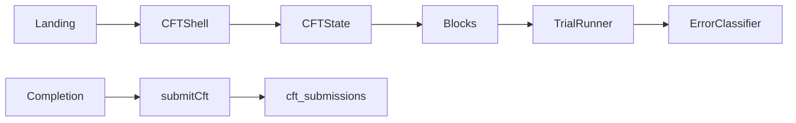

# Cognitive Flexibility Task — Implementation Plan

**Status:** Implemented scaffold (v0.1.0 provisional).  
**Attribution:** By Habib Labs LLC  
**Construct:** Cognitive flexibility / set-shifting (not inhibition, WM, or processing speed as primary)  
**Companions:** Grid Memory Task (GMT 2.2), Response Inhibition Task (RIT)

## Primary construct

Ability to abandon one correct rule and apply a different correct rule when demands change.

## Architecture

Mirror of RIT: `src/cft/` with `CFTShell` + `CFTState` + pure engines + phase pages. Route `/cft`. Landing hub lists three EF subtests.

## Blocks

| Block | Role | In CFS |
|-------|------|--------|
| practice | Shape then pattern; accuracy gate | No |
| rule_learning | Shape → pattern → number thirds | No |
| predictable_switch | AABB rule pairs | Yes |
| cued_switch | Mixed cued rules | Yes |
| interference | High incongruent density | Yes |

## Stimuli

Multi-feature objects: shape (circle/square), pattern (solid/striped), number (one/two). Cue banner names active rule. Left/Right (`F`/`J`) fixed mapping.

## Error taxonomy

perseverative · rule_maintenance · cue_processing · conflict · omission · anticipatory · invalid · other

## Primary score

Provisional **Cognitive Flexibility Score** (0–100). See `docs/CFT_SCORING.md`.

## Explicit non-claims

Not diagnostic, validated, normed, or an ADHD/IQ instrument. Themes never change scoring.
