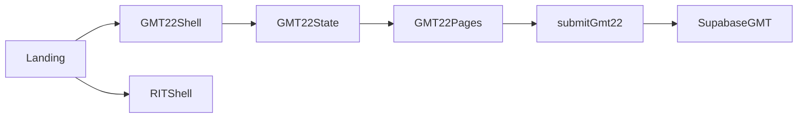
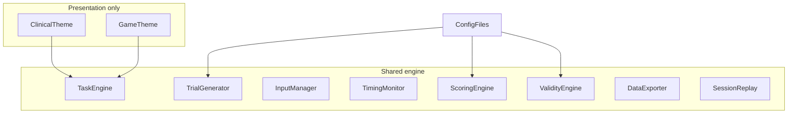
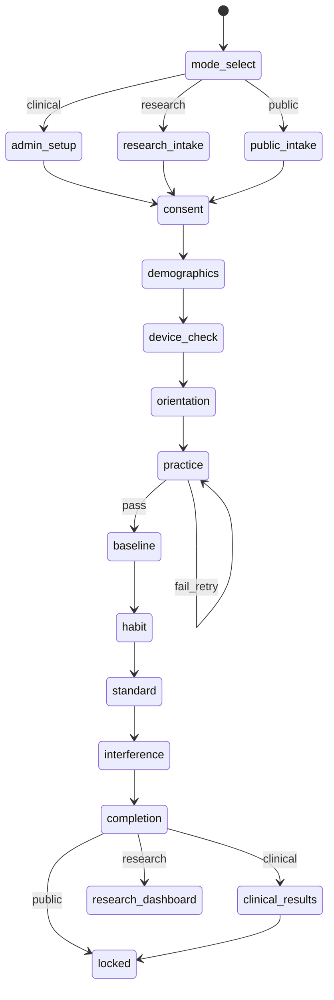

# Response Inhibition Subtest — Planning Document (Review Before Coding)

**Status:** Planning and design only. No production code in this phase.  
**Attribution:** By Habib Labs LLC  
**Construct:** Response inhibition (not attention, IQ, ADHD diagnosis, or processing-speed as primary labels)  
**Companion:** Grid Memory Task (GMT) — related but distinct EF construct  
**Phase 0 deliverable:** This file (`docs/RIT_IMPLEMENTATION_PLAN.md`)

This document is the deliverable for the design-review phase. It answers the planning assignment: inspect GMT, propose RIT architecture, schemas, randomization, stimuli, wireframes, scoring, open decisions, risks, privacy, testing, roadmap, and questions that must be answered before further coding.

**Repo note:** An experimental RIT module already exists under `src/rit/` (v0.1–v0.2). Treat it as a **provisional scaffold to validate or revise** after this plan is approved — not as finalized psychometrics.

**Explicit non-claims:** Do not describe this subtest as diagnostic, clinically validated, normed, HIPAA-compliant, an ADHD test, an IQ test, or equivalent to an established commercial neuropsychological battery.

---

## 1. Project purpose

Develop an experimental Response Inhibition Subtest for a larger executive-functioning battery alongside the Grid Memory Task.

| Audience (eventual) | Role of this subtest |
|---------------------|----------------------|
| Supervised clinical administration | Structured, examiner-controlled, no diagnostic labels |
| Academic / psychometric research | Raw + summary data, versioned scoring |
| Public participation | Engaging Game Mode; anonymous; no clinical claims |

Course / research framing: remain conceptually focused on **response inhibition**, even though the battery may later support a broader experimental EF composite (composite not finalized until subtests have psychometric support).

---

## 2. Primary construct

**Response inhibition:** ability to suppress a dominant, habitual, automatic, or already initiated response when that response is no longer appropriate.

The task should evaluate whether the participant can:

- learn a simple response rule  
- establish a habitual response pattern  
- maintain the current rule  
- detect an inhibition signal  
- withhold a response when required  
- balance speed and accuracy  
- sustain performance across increasing cognitive demands  

Attention and processing speed influence performance but remain **secondary process variables**. Do not market the subtest as a general attention test, processing-speed test, or diagnostic ADHD measure.

---

## 3. Relationship to the Grid Memory Task

| | Grid Memory Task | Response Inhibition Subtest |
|--|------------------|-----------------------------|
| Primary emphasis | Visual-spatial working memory; spatial maintenance/manipulation; attentional control under memory load | Suppression of automatic responses; impulsive-response control; rule monitoring; speed–accuracy regulation; inhibition under interference |
| Mechanic | 4×4 grid encoding / reconstruction | Visual go/no-go (no grid) |
| Scores | Span estimates, condition costs | Provisional Inhibitory Control Score + error/RT components |

The RIT must not reuse the grid mechanic or feel like another visual-memory task.

Eventual battery outputs:

- individual subtest scores  
- a broader experimental EF composite — **only after** sufficient psychometric support for each subtest  

---

## 4. Current GMT architecture (inspection)

| Layer | Choice |
|-------|--------|
| Stack | React 18 + Vite + TypeScript; `react-router-dom` |
| Canonical research protocol | `src/gmt22/` — phase shell inside the task (not deep React Router per screen) |
| Legacy | GMT 1.x under `src/pages/`, `src/lib/` |
| Persistence | Vercel serverless → Supabase (`gmt22_submissions` + long trials view) |
| Styling | Global `src/index.css`; Nunito titles + system UI |
| Landing | Battery hub: Grid Memory + Response Inhibition (`src/pages/Landing.tsx`) |



GMT 2.2 pattern to mirror: `Shell` + `State` + `types` + pure `lib/` + `pages/*` phase switcher (`src/gmt22/GMT22Shell.tsx`).

---

## 5. Reusable systems vs components that stay separate

### Reuse from GMT / shared app

- Seeded RNG (`src/lib/seedRandom.ts`)  
- Shell / phase-machine pattern from GMT22  
- Global CSS tokens, focus-visible styles, deploy/env (`VITE_API_URL`, Supabase)  
- Consent + demographics **flow shape** (not grid content)  
- Export philosophy: wide session + long trial + data dictionary  
- Researcher PIN / data patterns as a future extension point  

### Keep separate (do not share with GMT)

- Trial generation (go/no-go ≠ grid item banks)  
- Stimulus rendering (no 4×4 grid)  
- Response classification (commission / omission / anticipatory ≠ placement hits)  
- Scoring (Inhibitory Control Score ≠ span estimates)  
- Validity rules specific to inhibition  
- Clinical vs Game themes and copy  

**Do not redesign the Grid Memory Task in this workstream.**

---

## 6. Proposed Response Inhibition Task architecture

One **shared cognitive engine**; two **presentation themes**.



| Module | Responsibility |
|--------|----------------|
| TaskEngine / state machine | Block progression, practice gates |
| TrialGenerator | Seeded sequences, ratios, run constraints |
| StimulusRenderer | Instant paint; color + shape + border cues |
| InputManager | Keyboard (e.g. F/J) + touch Left/Right; invalid-key tracking |
| TimingMonitor | Onset/response timestamps, focus/visibility, timing-quality flag |
| ScoringEngine | Provisional ICS + components; versioned weights in config |
| ValidityEngine | Neutral quality flags (not “malingering”) |
| ConsentFlow / intakes | Clinical, research, public |
| ClinicalTheme / GameTheme | Copy, palette, transitions only |
| ClinicalResults / ResearchDashboard | Separate audiences |
| DataExporter / SessionReplay | CSV/JSON/dictionary; seed reconstruction |
| Configuration | Counts, timings, weights, thresholds, instructional text |

Proposed module root: `src/rit/` (already scaffolded provisionally).

Task logic, scoring, data collection, and visual design remain separated. Configuration files control block order, trial counts/ratios, timings, response windows, ITIs, difficulty hooks, scoring weights, validity thresholds, instruction text, and visual-mode settings — not hard-coded inside theme components.

---

## 7. Task state machine



### Task phases (research design)

1. **Orientation** — short instructions, visual demos, one rule at a time, practice vs scored clarity, comprehension check.  
2. **Motor / comprehension baseline** — accuracy, RT, misses, invalid keys; **excluded** from primary ICS.  
3. **Habit formation** — high go %, low no-go %, randomized, expectancy to respond.  
4. **Standard inhibition** — withhold on stop cue; commissions, omissions, RT, variability, anticipatory; no scored feedback.  
5. **Increased interference** — raise inhibitory demand without becoming a set-shift battery (e.g. mapping reversal via contextual frame).  
6. **Optional adaptive** — architected in config; **disabled** until reproducible and audited.  

### Provisional block parameters (reviewable — not locked psychometrics)

| Block | Trials (approx.) | Go ratio | In primary ICS |
|-------|------------------|----------|----------------|
| Practice | 10–12 | ~75% | No |
| Baseline | 16–20 | ~80% | No |
| Habit | 24–40 | ~85% | Yes |
| Standard | 32–48 | ~80% | Yes |
| Interference | 24–40 | ~80% | Yes |

A **pilot profile** may shorten counts while preserving ratios, timings, and scoring rules. Final distributions are empirical design decisions.

---

## 8. Session-level schema (proposed)

- `sessionId`, `anonymousParticipantId`, `studyId`  
- `administrationMode`, `visualMode`  
- `randomizationSeed`  
- `taskVersion`, `scoringVersion`, `consentVersion`, `studyVersion`  
- start / completion / total duration  
- device details, input method  
- practice repetitions / attempts  
- provisional primary score + component scores  
- block summaries  
- validity indicators, timing-quality indicator  
- completion status  
- examiner notes (clinical)  
- data-retention policy field  
- session lock flag  

---

## 9. Trial-level schema (proposed)

- `sessionId` (and study/participant linkage at export join time)  
- block number / `blockId` / `blockType`  
- `trialNumber`  
- `stimulusId`, stimulus features  
- go vs inhibition classification  
- current rule, expected response, actual response  
- accuracy, reaction time  
- stimulus onset time, response time, intertrial / ISI  
- commission, omission, anticipatory indicators  
- focus-loss, timing-irregularity indicators  
- device / input type (session-level may suffice; trial may inherit)  
- `scored` flag (whether trial enters primary ICS)  

**Raw trial data must never be discarded after calculating summary scores.**

---

## 10. Randomization and reproducibility

- Seeded PRNG (e.g. mulberry32); store seed on every session  
- Preserve intended go/no-go ratios per block  
- Cap consecutive same-type runs (constraint must be **mathematically feasible** given ratio — e.g. ~85% go cannot force a hard max-run of 4)  
- Space minority (no-go) trials; avoid obvious repeating / long ABAB patterns  
- Equivalent difficulty across sessions with same config version  
- Exact reconstruction via SessionReplay(seed + response log)  
- **Visual mode must not enter the generator**  

Document trial-generation rules separately from UI themes.

---

## 11. Stimulus concepts (for review — select one family)

Stimuli must be visually clear, culturally neutral, nonverbal during active trials, accessible without gaming experience, **not color-only** (combine color + shape + border/texture), and consistent across Clinical and Game presentations. Avoid relying primarily on red/green.

| Concept | Go-A | Go-B | No-Go | Interference idea |
|---------|------|------|-------|-------------------|
| **A. Signal Gate (provisional default)** | Blue diamond + vertical texture | Amber hexagon + hatch | Stop ring + slash | Double frame reverses A/B mapping |
| **B. Quality scanner** | Circle with vertical bars | Square with dots | Barred stamp | Border swaps mapping |
| **C. Observatory** | Star glyph | Moon glyph | Eclipse overlay | Conjunction: glyph + rim = withhold |
| **D. Sorting station** | Triangle tag | Trapezoid tag | Quarantine X | Previously go tag becomes no-go in late block |

**Provisional recommendation after approval:** Concept A (Signal Gate) — culturally light; works for both Clinical restraint and Game framing; matches current scaffold.

Possible response structure: category A → response A; category B → response B; inhibition signal → no response.

---

## 12. Clinical Mode wireframes (low-fi)

```
┌─────────────────────────────────────────┐
│  Response Inhibition Task               │
│  By Habib Labs LLC                      │
│  [Experimental notice]                  │
│                                         │
│  Respond as quickly and accurately      │
│  as possible. Do not respond when       │
│  the stop cue appears.                  │
│                                         │
│           ┌───────────┐                 │
│           │  stimulus │                 │
│           └───────────┘                 │
│                                         │
│      [ Left ]        [ Right ]          │
│                                         │
│  Examiner chrome: pre/post only         │
│  (ID, notes, results). No live scores.  │
└─────────────────────────────────────────┘
```

Characteristics: neutral background, minimal animation, high legibility, no points/rewards/celebrations/competitive language, no visible performance feedback during scored trials.

---

## 13. Game Mode wireframes (low-fi)

```
┌─────────────────────────────────────────┐
│  Signal Gate                            │
│  By Habib Labs LLC                      │
│  [Experimental notice]                  │
│                                         │
│  Keep the gate clear. Hold for          │
│  restricted signals.                    │
│                                         │
│           ┌───────────┐                 │
│           │  stimulus │  (same timing)  │
│           └───────────┘                 │
│              n / N                      │
│      [ Left ]        [ Right ]          │
│                                         │
│  Practice feedback only.                │
│  No scored-trial outcome cues.          │
└─────────────────────────────────────────┘
```

Game Mode may include light narrative, block transitions, restrained progress, brief practice feedback, optional accessibility-friendly sound (off by default), polished completion. Must not include leaderboards, rankings, power-ups, variable rewards, speed bonuses, distracting background motion during trials, scored-trial feedback, intelligence claims, or diagnostic interpretations.

Theme candidates (if Signal Gate is rejected): spacecraft scanning, security checkpoint, transport control, sorting station, observatory, robotic quality-control.

---

## 14. How both modes remain psychometrically equivalent

| Shared (must be identical) | May differ |
|----------------------------|------------|
| Seed, trial plan, stimuli, timing, response windows, block order, scoring, validity, data fields | Color palette, typography, instruction wording, visual framing, transitions, practice feedback style, completion screen |

**Acceptance criterion:** Same random seed + same responses → identical raw trial records and provisional ICS regardless of visual mode (automated audit / tests).

---

## 15. Provisional scoring approaches

### Primary: Experimental Inhibitory Control Score (ICS)

Reflect multiple aspects of performance, not simple reaction speed. Potential components:

- commission-error rate  
- omission-error rate  
- correct-response reaction time  
- reaction-time variability  
- anticipatory responses  
- excessive slowing  
- performance during high-interference trials  

**Rules:**

- Store all raw variables  
- Transparent formulas; weights in a configurable file  
- Preserve `scoringVersion` / weights ID  
- Display composite **and** component scores  
- Permit recalculation after scoring revisions  
- Practice and baseline **excluded** from primary ICS  

**No** percentiles, standard scores, impairment ranges, or clinical classifications before normative/validity studies.

### Secondary process scores

Commission Errors; Omission Errors; Mean / Median RT; RT SD; RT CV; Anticipatory Responses; Post-Error Slowing; Accuracy by Block; RT by Block; High-Interference Accuracy / RT; Performance change across blocks; Speed–Accuracy Tradeoff indicator; Practice Accuracy / Attempts; Timing Quality; Session Validity.

### Speed–accuracy tradeoff

Do not reward impulsive fast responding. Do not treat all slow responding as impairment. Distinguish fast-accurate, fast-error-prone, slow-accurate, slow-error-prone, and highly inconsistent patterns. Separate speed and accuracy components may precede any composite.

---

## 16. Validity and data-quality flags

Potential flags: incomplete session; failure to pass practice; extremely high omission or commission; chance-level responding; repeated anticipatory responses; unusually rapid responses; excessive focus loss; unsupported device; timing instability; repetitive response pattern; failure to understand a rule change.

**Wording (neutral):**  
“Performance may not be interpretable because engagement, comprehension, or technical conditions were inconsistent.”

Do not label flags as malingering, deception, or intentional poor effort.

---

## 17. Timing integrity and device risks

| Risk | Mitigation |
|------|------------|
| Browser RT imprecision | `performance.now()`; session timing-quality ordinal; do not overclaim millisecond precision |
| Focus / tab switch | Record events; trial-level focus-loss flags |
| Dropped frames | Optional requestAnimationFrame gap hints |
| Touch vs keyboard | Record input method; avoid modality-specific scoring until studied |
| Small / unsupported screens | Minimum viewport check; **flag**, do not silently administer |
| Animations delaying onset | No entrance animation on stimulus paint |

Timing problems should identify specific concerns and preserve raw data; they need not auto-void the entire session without review.

---

## 18. Privacy and consent architecture

| Context | Approach |
|---------|----------|
| **Public** | Plain-language consent; anonymous/pseudonymous ID; minimize identifiers; privacy explanation; optional demographics; withdraw before submission; no clinical interpretation; recontact stored separately from performance |
| **Research** | Study code; participant code; consent; eligibility; configurable demographics; debrief; exportable data; task- and scoring-version tracking |
| **Clinical** | Examiner-created ID; examiner start; optional notes; detailed results; session lock; trial-level review; validity warnings; no participant-facing diagnosis |

**Public minimization:** no full names, addresses, complete birth dates, or medical-record information. Sensitive clinical history only when necessary for an approved protocol.

Every session stores consent, task, scoring, and study version numbers plus retention-policy field. Do not advertise HIPAA compliance unless deployment, storage, access controls, policies, and agreements support that claim.

### Recommended public/research participant variables

Anonymous ID; age or age band; education; dominant hand; primary language; broad region; device type; keyboard vs touch; vision correction; color-vision difficulty; sleep estimate; caffeine use. Neurological/psychiatric items only if protocol-approved and clearly optional.

---

## 19. Results views

### Participant completion

Show: completion confirmation; neutral thank-you; brief research-purpose explanation; withdrawal/contact info when relevant.  
Do **not** show: impairment labels, diagnoses, percentiles without norms, intelligence claims, clinical-population comparisons.

### Clinical results

Provisional ICS; component scores; block-level performance; speed–accuracy pattern; timing quality; validity indicators; trial-level data; examiner notes; clear experimental-status notice.

### Research dashboard

Session counts; completion; valid vs flagged; score / commission / omission / RT distributions; device and visual-mode breakdown; block-level summaries; version filters; data-quality warnings; export controls.

---

## 20. Data export

Support: session-level CSV; trial-level CSV; JSON; SPSS-friendly names; data dictionary; scoring documentation; task- and scoring-version metadata.

Dictionary fields: variable name, label, type, allowable values, missing-value code, scoring role, privacy classification. Prefer stable names across versions.

---

## 21. Accessibility

Keyboard and touchscreen; adjustable text size; high contrast; reduced motion; sound off; non-color-only cues; clear focus states; readable instructions; screen-size validation; practice repetition. Sound must never be required unless a separate auditory task is intentionally developed.

---

## 22. Testing strategy

Automated tests should cover:

- reproducible seeded randomization  
- correct trial ratios; invalid-sequence prevention  
- response classification; commission / omission / anticipatory detection  
- RT calculation; score calculation; scoring-version preservation  
- validity-flag activation; complete data export  
- session interruption; focus-loss and timing-quality tracking  
- unsupported-device handling  
- **identical scoring across Clinical and Game Modes**  

Simulated profiles: average/accurate; fast/impulsive; slow/cautious; inconsistent; high omission; high commission; random; failed practice; interrupted; technically invalid.

---

## 23. Psychometric development plan (post-implementation)

### Initial pilot goals

Rule comprehension; difficulty calibration; whether inhibition trials yield analyzable errors; RT stability; whether interference increases demand; Clinical vs Game comparability; device effects; practice effects.

### Later reliability

Internal consistency where appropriate; split-half; test–retest; block stability; RT and error-rate reliability.

### Construct validity

Compare with established inhibition, sustained attention, processing speed, working memory, and flexibility measures — seek convergence with inhibition and divergence from neighboring domains.

### Norms

Not from a small convenience sample. Consider age, education, language, device, input, visual mode, gaming familiarity, culture/geography. No clinical cutoffs until adequate comparison samples exist.

---

## 24. Unresolved psychometric / design decisions (must remain open)

Cursor must not silently finalize:

- exact visual theme and stimuli  
- exact trial counts, block durations, go/no-go ratios  
- response window and intertrial interval  
- interference rule (mapping reverse vs conjunction vs cue flip)  
- adaptive difficulty in scoring  
- scoring weights and validity thresholds  
- composite EF battery formula  
- normative interpretation / clinical cutoffs  
- anticipatory RT cutoff; practice pass / discontinue rules  
- whether a future stop-signal / SSRT module is required  

Present these as explicit research decisions.

---

## 25. Phased development roadmap

| Phase | Scope | Implementation status |
|-------|-------|------------------------|
| **0 — Design review (this document)** | Approve construct, stimuli family, schemas, open decisions | Done (this file) |
| **1 — Shared engine** | Config, generator, classification, timing, scoring, validity (pure TS) | Done in `src/rit/` |
| **2 — Clinical UI** | Orientation → blocks → completion → clinical results | Done |
| **3 — Game UI** | Theme/copy only on same engine | Done |
| **4 — Admin contexts** | Clinical / research / public intakes + consent | Done (+ eligibility/debrief) |
| **5 — Persistence & export** | Local archive + optional Supabase wide/long + dictionary | Done |
| **6 — Tests & audit** | Unit tests + mode-equivalence audit | Done |
| **7 — Supervised pilot** | n≈20–40; mode counterbalance; config tuning only | Materials: `docs/RIT_PHASE7_PILOT.md` (human data external) |
| **8 — Psychometrics** | Reliability, convergent validity, then norms (later) | Plan only: `docs/RIT_PHASE8_PSYCHOMETRICS.md` |

Provisional answers to §26: `docs/RIT_PROVISIONAL_DECISIONS.md`.

Battery-wide shared demographics sequencing and EF composite: **after** subtest-level evidence.

---

## 26. Questions that must be answered before further coding / revision

1. Confirm or replace **Signal Gate** as the stimulus family.  
2. Confirm interference = **mapping reversal via frame** (vs conjunction / cue flip).  
3. Approve provisional trial counts and go ratios for first pilot (full vs short pilot profile).  
4. Approve anticipatory cutoff and practice pass rule as **placeholders**.  
5. Confirm public demographics set (neurological history protocol-gated).  
6. Confirm persistence for next pilot: local-only vs Supabase live.  
7. Confirm Game Mode theme name/copy tone.  
8. Confirm whether existing `src/rit/` scaffold is **accepted as Phase 1–6 base** or requires redesign against this document.  
9. IRB / course: required consent text and retention wording.  
10. Counterbalance plan for Clinical vs Game in the first pilot (half/half; never mix mid-session).  

---

## 27. Mapping of provisional scaffold (reference only)

If reviewers accept the existing module as a starting base, the following already align directionally with this plan (still experimental; weights/thresholds remain open):

| Plan element | Provisional location |
|--------------|----------------------|
| Shell / state | `src/rit/RITShell.tsx`, `RITState.tsx` |
| Config | `src/rit/config/*` |
| Engines | `src/rit/lib/*` |
| Themes / pages | `src/rit/components/*`, `src/rit/pages/*` |
| Scoring docs | `docs/RIT_SCORING.md` |
| Export / pilot | `docs/RIT_DATA_EXPORT.md`, `docs/RIT_PILOT_CHECKLIST.md` |
| Equivalence audit | `npm run audit:rit` |

Acceptance or redesign of this scaffold is **Question 8** above — not assumed by this planning phase.

---

## 28. Deliverable of this phase

**This planning document** (`docs/RIT_IMPLEMENTATION_PLAN.md`) is the Phase 0 deliverable.

**No production code changes in this phase.**

After review answers to §26 (Questions), implementation or revision of the `src/rit/` scaffold proceeds under a **separate execution plan** (Phases 1–8). Do not treat provisional scoring weights, trial counts, or validity thresholds as psychometrically established until pilot data support them.
